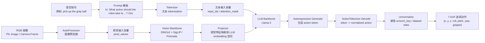
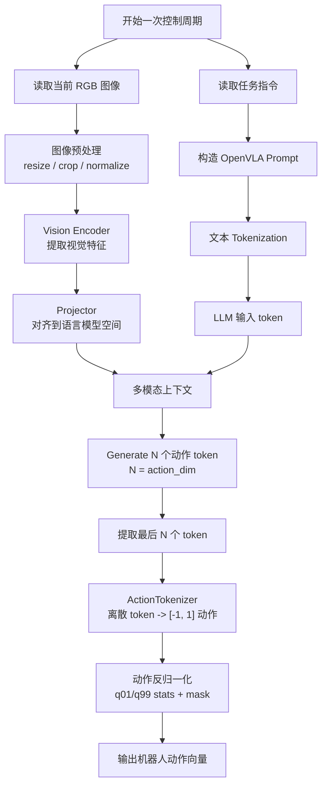
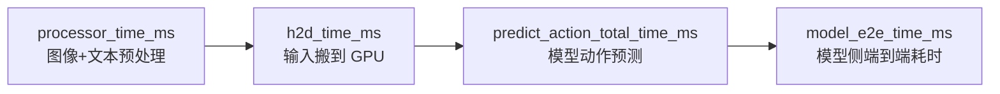

# OpenVLA 模型结构图

本文档用 Mermaid 图说明 OpenVLA 从输入图像和语言指令到输出机器人动作的完整推理链路。

## 1. 总体结构



## 2. 按推理阶段展开



## 3. 和代码的对应关系

```mermaid
flowchart LR
    A[check_model.py / bench_e2e.py] --> B[AutoProcessor.from_pretrained]
    A --> C[AutoModelForVision2Seq.from_pretrained]

    B --> D[processor(prompt, image)]
    D --> E[inputs.to cuda / bfloat16]
    E --> F[model.predict_action]

    F --> G["prismatic/models/vlas/openvla.py<br/>predict_action"]
    G --> H[super.generate]
    H --> I[predicted_action_token_ids]
    I --> J["prismatic/vla/action_tokenizer.py<br/>decode_token_ids_to_actions"]
    J --> K[get_action_stats / unnormalize]
    K --> L[action ndarray]
```

## 4. 输入和输出

### 输入

OpenVLA 的推理输入可以简化成：

```text
输入 = RGB 图像 + 语言任务指令
```

在代码中通常是：

```python
prompt = f"In: What action should the robot take to {instruction}?\nOut:"
inputs = processor(prompt, image).to(DEVICE, dtype=torch.bfloat16)
```

其中：

- `image`：当前相机图像，通常是 RGB 图片。
- `instruction`：自然语言任务，例如 `pick up the gray ball`。
- `processor`：同时负责图像预处理和文本 tokenization。

### 输出

OpenVLA 输出的是连续动作向量：

```text
[action_x, action_y, action_z, action_roll, action_pitch, action_yaw, gripper]
```

常见是 7 维动作：

```text
[x, y, z, roll, pitch, yaw, gripper]
```

注意：具体坐标系、动作尺度、夹爪开合方向取决于训练数据集和机器人控制接口。

## 5. 动作 token 机制

OpenVLA 的动作输出并不是普通回归头直接预测 float，而是借助 LLM 的 token 生成能力。

```mermaid
flowchart LR
    A[连续机器人动作] --> B[归一化到 [-1, 1]]
    B --> C[256-bin 离散化]
    C --> D[映射到 LLM 词表末尾 token]
    D --> E[训练模型生成这些 token]

    F[推理时生成 action token] --> G[ActionTokenizer 解码]
    G --> H[归一化动作]
    H --> I[反归一化]
    I --> J[真实机器人动作]
```

对应代码：

- 动作离散化与解码：`prismatic/vla/action_tokenizer.py`
- 动作生成与反归一化：`prismatic/models/vlas/openvla.py`

## 6. Benchmark 脚本中测量的链路

`bench_e2e.py` 主要测下面这条链路：



这些指标不包含：

- 相机采集耗时
- ROS / 网络传输耗时
- 机器人底层控制器执行耗时
- 安全策略、滤波、轨迹插值耗时

因此真实控制闭环延迟应为：

```text
真实闭环延迟 = 相机/通信/控制器耗时 + model_e2e_time_ms
```

## 7. 简化版一句话图

```text
RGB 图像 + 任务指令
        ↓
AutoProcessor
        ↓
Vision Backbone + LLM Backbone
        ↓
生成动作 token
        ↓
ActionTokenizer 解码
        ↓
反归一化
        ↓
7 维机器人动作
```
